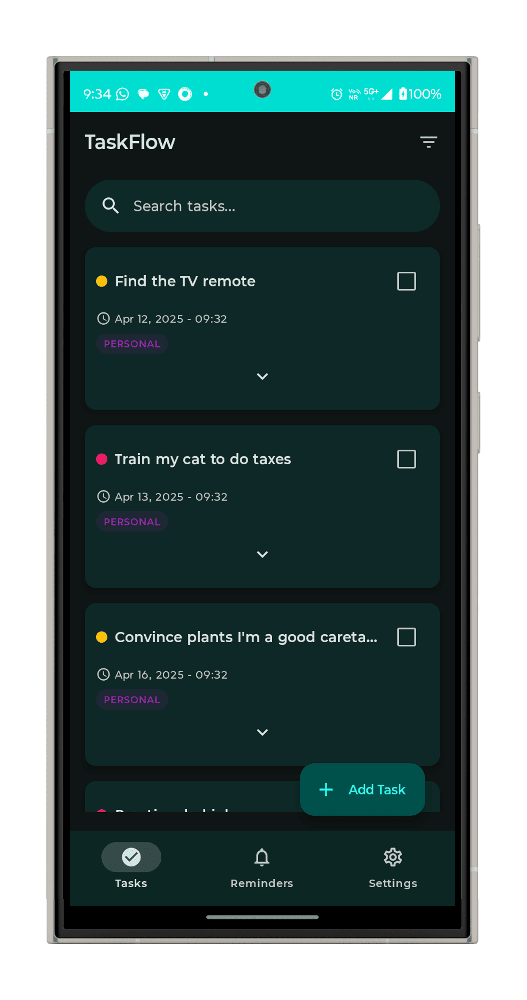
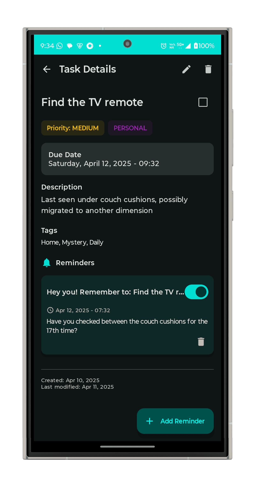
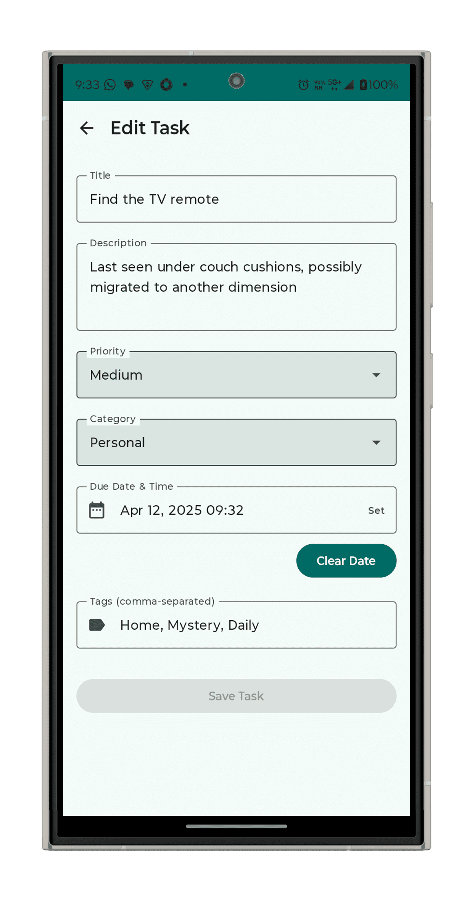
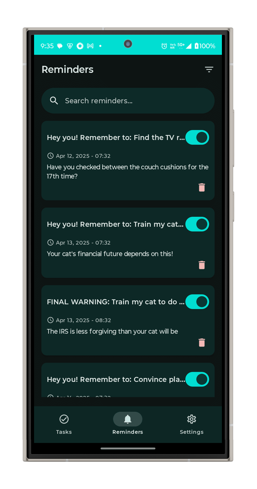
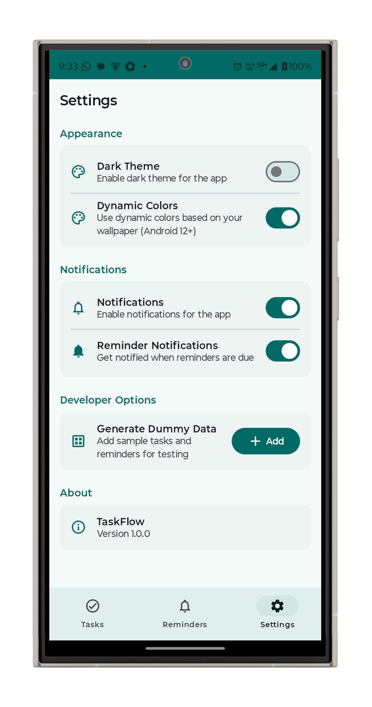

# TaskFlow

A modern Android task management app showcasing multi-module architecture, Jetpack Compose, and MVVM with Clean Architecture principles.

## Features ✨

- **Task Management**: Create, edit, and organize tasks with priorities and deadlines
- **Reminders**: Set up notifications for important tasks
- **Categories & Labels**: Organize tasks with custom categories
- **Dark/Light Theme**: Full support for system theme preferences
- **Offline First**: Works without internet connection
- **Clean UI**: Modern Material 3 design

## Tech Stack 🛠️

- **100% Kotlin**
- **Multi-module Architecture**: Features, Core, Data, Domain
- **Jetpack Compose**: Modern declarative UI
- **Hilt**: Dependency injection
- **Room**: Local database persistence
- **WorkManager**: Background task scheduling
- **Kotlin Coroutines/Flow**: Asynchronous programming
- **Material 3**: Modern UI components and theming
- **Navigation Compose**: Seamless navigation between screens

## Architecture 📐

The project follows Clean Architecture principles with a multi-module approach:

```
:app (entry point)
|
├── :core (common components)
│   ├── ui (theme/components)
│   ├── utils (extensions/helpers)
│   └── navigation (compose navigation)
|
├── :data (data layer)
│   ├── local (Room database/DAOs)
│   └── repository (data repository impl)
|
├── :domain (business logic)
│   ├── model (entities)
│   ├── repository (interfaces)
│   └── usecases (business rules)
|
└── :features (UI features)
    ├── tasks (task list/details/edit)
    ├── reminders (reminder management)
    └── settings (app preferences)
```

### Key Benefits

- **Maintainability**: Isolated modules for better code organization
- **Testability**: Clear separation of concerns makes testing easier
- **Scalability**: Easy to add new features without affecting existing code
- **Faster Build Times**: Modular compilation and caching

## Screenshots 📱

<p align="center">
  
  
  
  
  
  
</p>

## Getting Started 🚀

1. Clone the repository
2. Open the project in Android Studio Arctic Fox or later
3. Sync Gradle files
4. Run the app on an emulator or physical device

## Testing 🧪

The project includes:
- **Unit Tests**: ViewModels, Use Cases, Repositories
- **UI Tests**: Compose component testing
- **Integration Tests**: Navigation flows

## About the Author 👨‍💻

This project is developed by **Khemraj Sharma**, an Android Expert with 9+ years of experience:

- **Android & React Native Developer** with 30+ successful projects delivered
- **Ranked in the Top 0.002%** of developers worldwide on Stack Overflow
- **Specialized in Kotlin, MVVM, Jetpack** and modular architecture
- **Stack Overflow:** [khemraj-sharma](https://stackoverflow.com/users/6891563/khemraj-sharma)
- **GitHub:** [khemrajsharma](https://github.com/khemrajsharma)
- **LinkedIn:** [khemrajsharma](https://www.linkedin.com/in/khemrajsharma/)
- **Portfolio:** [khemrajsharma](https://khemrajsharma.com)

## License 📝

```
MIT License

Copyright (c) 2025 Khemraj Sharma
``` 
